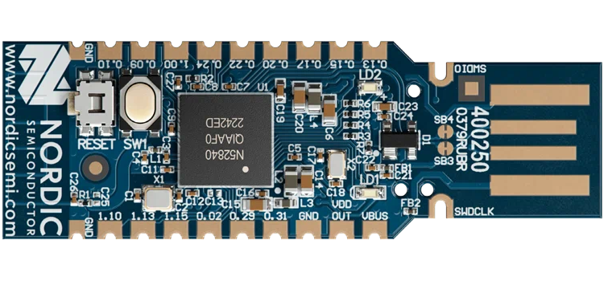
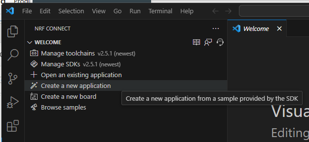
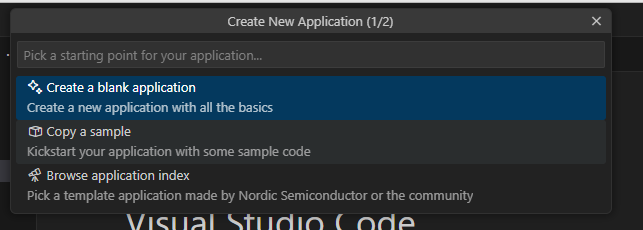
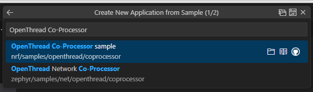
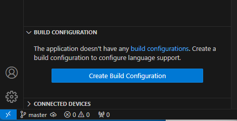
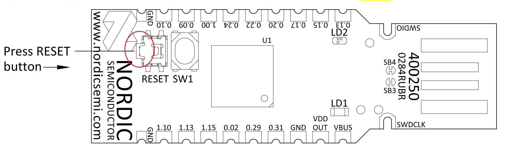
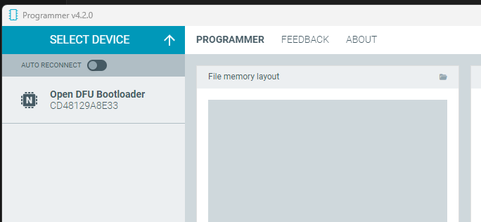
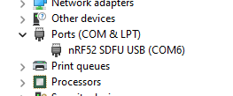

# Create a Radio Co-Processor for OpenThread Border Router with a Nordic Semiconductor nRF52840 USB Dongle

### Author: [Olav Tollefsen](https://www.linkedin.com/in/olavtollefsen/)

## Introduction

This article shows how to create a Radio Co-Processor for use with OpenThread Border Router using a Nordic Semiconductor nRF52840 USB Dongle.



## What you will need

- A PC running Windows as the development workstation.
- Install nRF Connect for Desktop from Nordic Semiconductor.
- Raspberry Pi Model 3B or newer
- Nordic Semiconductor nRF52840 USB Dongle.

## Install the required tools and SDK

### Install nRF Command Line Tools

Download and install from here:

https://www.nordicsemi.com/Products/Development-tools/nRF-Command-Line-Tools/Download?lang=en#infotabs


### Install nRF Util

Download the executable file from here:

https://www.nordicsemi.com/Products/Development-tools/nrf-util

Move it to a directory on the system path (for example the directory created by the installation of the nRF Command Line Tools):

Copy the downloaded file "nrfutil.exe" to "C:\Program Files\Nordic Semiconductor\nrf-command-line-tools\bin"

## Install the nrf5sdk-tools command

Run the command:

```
$ nrfutil install nrf5sdk-tools
```

## Install nRF Connect for Desktop

Download and install from here:

https://www.nordicsemi.com/Products/Development-tools/nRF-Connect-for-Desktop/Download#infotabs

nRF Connect for Desktop installation contains "J-Link Software and Documentation pack", but most likely an older version.

You can download a newer version here:

https://www.segger.com/downloads/jlink/

Then you need to uninstall the old version.

### Install Visual Studio Code

Download and install from :

https://code.visualstudio.com/download

### Install the nRF Connect for VS Code Extension Pack

Click on the Extensions icon in the left navigation bar. Search for "nRF Connect", select the "nRF Connect for VS Code Extension Pack" and install it.

### Install the Toolchain

Select the nRF Connect icon in the left navigation bar of Visual Studio Code, then click the "Install Toolchain" button and select the latest version.

### Install the nRF Connect SDK

Select the nRF Connect icon in the left navigation bar of Visual Studio Code, then click "Manage SDKs" and select "Install SDK", select latest version and accept the suggested default path for installation.

## Create an OpenThread Radio Co-Processor using the nRF52840 USB Dongle

### Create a new application for the OpenTHread Radio Co-Processor (RCP)

Click "Create New Application".



Select "Copy a sample" and search for "OpenThread Co-Processor sample":





Open the new application in Visual Studio Code

### Create a new Build Configuration and start the build

Click on the "nRF Connect" icon in the left menu and click on "Create Build Configuration":



Make sure "nrf52840dongle_nrf52840" is selected as the board and then click "Build Configuration".

A .hex file will be created in the build/zephyr directory.

### Set the nRF52840 USB Dongle in Bootloader mode

Note! In order to program the nRF52840 USB Dongle it needs to be set into Bootloader mode. This is done by pressing the Reset button. This is NOT the obviuos SW1 button, but a smaller sideways button right next to it as shown on the figure below:



Now you can either use the nRF Connect Programmer (launched from nRF Connect for Desktop) or command line tools to program the firmware to the nRF52840 USB Dongle.

### Programming using the nRF Connect Programmer

Click on "SELECT DEVICE" and select the nRF52840 USB Dongle.



Click "Add file" and select the .hex file generated during the build.

Click "Write" to program the firmware to the nRF52840 USB Dongle.

### Programming using command line tools

#### Generate the RCP firmware package

(assumes that nrfutil is in the system path)

```
nrfutil pkg generate --hw-version 52 --sd-req=0x00 --application build/zephyr/zephyr.hex --application-version 1 build/zephyr/zephyr.zip
```

#### Install the RCP firmware package onto the dongle

On Windows check the device name for the nRF52840 USB Dongle in Device Manager.



```
nrfutil dfu usb-serial -pkg build/zephyr/zephyr.zip -p COMx:
```

```
nrfutil dfu usb-serial -pkg build/zephyr/zephyr.zip -p /dev/ttyACM0
```

## Use it with OpenThread Border Router

Your nRF52840 USB Dongle is now ready to be used as an OpenThread Radio Co-Processor with an OpenThread Border Router.


https://github.com/openthread/ot-nrf528xx/blob/main/src/nrf52840/README.

https://github.com/microsoft/uf2

python3 -m pip install --pre -U git+https://github.com/makerdiary/uf2utils.git@main

https://studiofuga.com/blog/2023-05-19-changing-firmware-of-mdk-usb-dongle/

https://developer.nordicsemi.com/nRF_Connect_SDK/doc/1.9.99-dev1/matter/openthread_rcp_nrf_dongle.html

https://developer.nordicsemi.com/nRF_Connect_SDK/doc/latest/nrf/protocols/thread/tools.html#configuring-a-radio-co-processor

https://wiki.makerdiary.com/nrf52840-mdk-usb-dongle/guides/ncs/samples/thread/coprocessor/#overview

